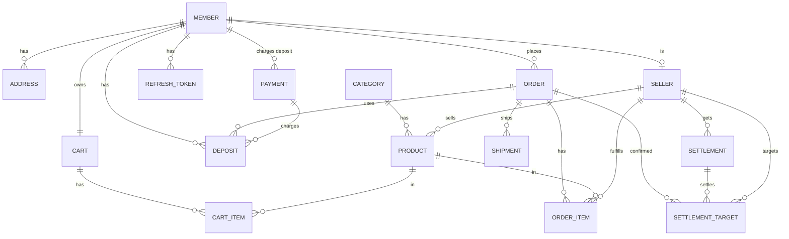

# ERD (Entity Relationship Diagram)

## 상세 ERD (테이블 컬럼 포함)

```mermaid
erDiagram
    MEMBER {
        UUID id PK "회원 고유 식별자"
        VARCHAR_255 email UK "로그인 이메일"
        VARCHAR_255 password_hash "BCrypt 해싱된 비밀번호"
        VARCHAR_100 name "회원 이름"
        VARCHAR_20 phone "연락처"
        ENUM role "회원 권한 (USER | SELLER | ADMIN)"
        ENUM status "회원 상태 (ACTIVE | SUSPENDED | WITHDRAWN)"
        INT point_balance "포인트 잔액"
        INT deposit_balance "예치금 잔액 (payment-service AFTER_COMMIT 이벤트로 동기화)"
        BOOLEAN email_verified "이메일 인증 여부"
        TIMESTAMP created_at "가입 일시"
        TIMESTAMP updated_at "최종 수정 일시"
        BIGINT version "낙관적 잠금 버전"
    }
    REFRESH_TOKEN {
        UUID id PK "토큰 고유 식별자"
        UUID member_id FK "소유 회원"
        VARCHAR_512 token_hash "해싱된 리프레시 토큰"
        VARCHAR_255 user_agent "요청 브라우저/클라이언트 정보"
        VARCHAR_45 ip_address "토큰 발급 IP"
        BOOLEAN is_revoked "폐기 여부"
        TIMESTAMP expires_at "토큰 만료 시각"
        TIMESTAMP created_at "발급 일시"
        TIMESTAMP last_used_at "마지막 사용 일시"
    }
    TOKEN_BLACKLIST {
        BIGINT id PK "AUTO_INCREMENT"
        VARCHAR_255 jti UK "Access Token 고유 식별자"
        TIMESTAMP expires_at "해당 토큰 만료 시각"
        TIMESTAMP created_at "블랙리스트 등록 시각"
    }
    ADDRESS {
        UUID id PK "배송지 고유 식별자"
        UUID member_id FK "소유 회원"
        VARCHAR_100 recipient "수령인 이름"
        VARCHAR_20 phone "수령인 연락처"
        VARCHAR_10 zipcode "우편번호"
        VARCHAR_255 address1 "기본 주소"
        VARCHAR_255 address2 "상세 주소"
        BOOLEAN is_default "기본 배송지 여부"
        BOOLEAN is_deleted "소프트 삭제 여부"
    }
    SELLER {
        UUID id PK "판매자 고유 식별자"
        UUID member_id FK "회원 FK"
        VARCHAR_20 business_number UK "사업자등록번호"
        VARCHAR_100 shop_name "상호명"
        VARCHAR_255 bank_code "은행 코드 (AES 암호화 → 255byte)"
        VARCHAR_255 bank_account "계좌번호 (AES 암호화 → 255byte)"
        VARCHAR_255 account_holder "예금주명 (AES 암호화 → 255byte)"
        DECIMAL_5_2 commission_rate "수수료율"
        ENUM status "판매자 상태 (PENDING | APPROVED | SUSPENDED)"
        TIMESTAMP approved_at "승인 일시"
    }
    CATEGORY {
        UUID id PK "카테고리 고유 식별자"
        UUID parent_id FK "상위 카테고리 (계층형)"
        VARCHAR_100 name "카테고리명"
        VARCHAR_100 slug UK "URL 슬러그"
        INT depth "계층 깊이"
        INT sort_order "정렬 순서"
        BOOLEAN is_active "활성 여부"
    }
    PROCESSED_EVENTS {
        VARCHAR event_id PK "Kafka eventId (UUID 문자열), 중복 처리 방지 — settlement_db"
        TIMESTAMP processed_at "처리 완료 시각"
    }
    PRODUCT {
        UUID id PK "상품 고유 식별자"
        UUID seller_id FK "등록 판매자"
        UUID category_id FK "소속 카테고리"
        VARCHAR_20 isbn UK "국제표준도서번호"
        VARCHAR_300 title "도서 제목"
        VARCHAR_200 author "저자"
        VARCHAR_100 publisher "출판사"
        INT price "판매 가격"
        INT quantity "재고 수량"
        BIGINT version "낙관적 잠금 버전"
        ENUM book_type "도서 유형 (NEW | USED)"
        ENUM status "상품 상태 (PENDING_REVIEW | ACTIVE | INACTIVE | SOLD_OUT)"
        DECIMAL_3_2 avg_rating "평균 평점"
        INT review_count "리뷰 수"
        TIMESTAMP created_at "등록 일시"
    }
    CART {
        UUID id PK "장바구니 고유 식별자"
        UUID member_id FK "소유 회원 (회원당 1개)"
        TIMESTAMP created_at "생성 일시"
    }
    CART_ITEM {
        UUID id PK "장바구니 항목 고유 식별자"
        UUID cart_id FK "소속 장바구니"
        UUID product_id FK "담은 상품"
        INT quantity "수량"
        TIMESTAMP added_at "담은 일시"
    }
    DEPOSIT {
        UUID id PK
        UUID member_id FK
        UUID payment_id FK "충전 시 결제 건 참조 (CHARGE일 때)"
        UUID order_id FK "사용 시 주문 참조 (USE일 때)"
        ENUM type "CHARGE | USE | REFUND"
        INT amount "변동 금액"
        INT balance_after "변동 후 잔액 스냅샷"
        VARCHAR_255 description
        TIMESTAMP created_at
    }
    ORDER {
        UUID id PK "주문 고유 식별자"
        VARCHAR_30 order_number UK "주문번호 (yyyyMMdd + UUID hex)"
        UUID member_id FK "주문 회원"
        ENUM status "주문 상태 (PENDING | PAID | CONFIRMED | SHIPPING | DELIVERED | PURCHASE_CONFIRMED | CANCELLED)"
        INT total_amount "주문 총 금액 (서버 계산)"
        INT shipping_fee "배송비"
        INT deposit_used "예치금 차감액"
        JSONB shipping_snapshot "주문 시점 배송지 스냅샷"
        VARCHAR_100 idempotency_key UK "중복 주문 방지 멱등키"
        UUID address_id FK "배송지 참조"
        TEXT cart_item_ids "장바구니 항목 ID 목록 (콤마 구분)"
        TIMESTAMP confirmed_at "구매확정 시각 (PURCHASE_CONFIRMED 전환 시 기록, NULL 허용)"
        TIMESTAMP delivered_at "배송 완료 일시"
        TIMESTAMP created_at "주문 생성 일시"
        BIGINT version "낙관적 잠금 버전"
    }
    ORDER_ITEM {
        UUID id PK "주문 항목 고유 식별자"
        UUID order_id FK "소속 주문"
        UUID product_id FK "주문 상품"
        UUID seller_id FK "판매자"
        VARCHAR_300 product_title "주문 시점 상품명 스냅샷"
        INT unit_price "주문 시점 단가 스냅샷"
        INT quantity "주문 수량"
        INT subtotal "소계 (unit_price x quantity)"
        ENUM status "주문 항목 상태"
    }
    SHIPMENT {
        UUID id PK "배송 고유 식별자"
        UUID order_id FK "소속 주문"
        VARCHAR_50 carrier "택배사"
        VARCHAR_50 tracking_number "송장번호"
        ENUM status "배송 상태 (PREPARING | SHIPPED | IN_TRANSIT | DELIVERED | RETURNED)"
        TIMESTAMP shipped_at "발송 일시"
        TIMESTAMP delivered_at "배송 완료 일시"
    }
    PAYMENT {
        UUID id PK "결제 고유 식별자"
        UUID member_id FK "결제 수행 회원"
        UUID order_id "nullable - 미사용 (현재 DEPOSIT_CHARGE 목적만 존재, UNIQUE)"
        ENUM pg_provider "PG사 (TOSS)"
        INT amount "결제 금액"
        ENUM status "결제 상태 (PENDING | COMPLETED | FAILED | CANCELLED)"
        VARCHAR_200 pg_transaction_id UK "PG 거래 식별자 (nullable)"
        VARCHAR_500 payment_key "PG 결제키 (AES-256-GCM 암호화 저장, nullable)"
        ENUM method "결제 방식 (PG | DEPOSIT)"
        ENUM purpose "결제 목적 (DEPOSIT_CHARGE)"
        TIMESTAMP paid_at "결제 승인 시각 (nullable)"
        VARCHAR_100 idempotency_key UK "중복 결제 방지 멱등키"
    }
    SETTLEMENT_TARGET {
        UUID id PK "settlement_db (Settlement Service)"
        UUID order_id FK
        UUID seller_id FK
        BIGINT total_amount "해당 주문에서 이 판매자 매출"
        TIMESTAMP confirmed_at "구매확정 시각"
        UUID settlement_id FK "nullable - 정산 완료 후 연결"
        ENUM status "PENDING | SETTLED"
    }
    SETTLEMENT {
        UUID id PK "settlement_db (Settlement Service)"
        UUID seller_id FK
        DATE period_start "집계 시작일"
        DATE period_end "집계 종료일"
        BIGINT total_sales_amount "총 매출"
        BIGINT fee_amount "수수료"
        BIGINT net_amount "순 정산 금액"
        TIMESTAMP settled_at "정산 실행 시각"
        ENUM status "PENDING | COMPLETED | FAILED"
    }
    SHEDLOCK {
        VARCHAR_64 name PK "락 이름 (e.g. monthly-settlement)"
        TIMESTAMP lock_until "락 만료 시각 (lockAtMostFor 기준 자동 해제)"
        TIMESTAMP locked_at "락 획득 시각"
        VARCHAR_255 locked_by "락을 획득한 인스턴스 (hostname)"
    }

    MEMBER ||--o{ ADDRESS : has
    MEMBER ||--o| SELLER : becomes
    MEMBER ||--|| CART : owns
    MEMBER ||--o{ ORDER : places
    MEMBER ||--o{ DEPOSIT : "충전/사용 이력"
    MEMBER ||--o{ REFRESH_TOKEN : has
    MEMBER ||--o{ PAYMENT : "예치금 충전"

    CATEGORY ||--o{ CATEGORY : parent_of
    CATEGORY ||--o{ PRODUCT : classifies

    SELLER ||--o{ PRODUCT : sells
    SELLER ||--o{ ORDER_ITEM : fulfills
    SELLER ||--o{ SETTLEMENT_TARGET : "정산 대상"
    SELLER ||--o{ SETTLEMENT : receives

    PRODUCT ||--o{ CART_ITEM : added_as
    PRODUCT ||--o{ ORDER_ITEM : ordered_as

    CART ||--o{ CART_ITEM : contains

    ORDER ||--o{ ORDER_ITEM : contains
    ORDER ||--|| SHIPMENT : ships_with
    ORDER ||--o{ DEPOSIT : "예치금 사용 이력"

    PAYMENT ||--o{ DEPOSIT : "충전 결제 참조"

    ORDER ||--o{ SETTLEMENT_TARGET : "구매확정 시 생성"
    SETTLEMENT ||--o{ SETTLEMENT_TARGET : "월 정산 시 연결"
```

---

## 관계 중심 ERD (개요)

```mermaid
erDiagram
    MEMBER ||--o{ ADDRESS : has
    MEMBER ||--|| CART : owns
    MEMBER ||--o{ ORDER : places
    MEMBER ||--o| SELLER : is
    MEMBER ||--o{ DEPOSIT : has
    MEMBER ||--o{ REFRESH_TOKEN : has
    MEMBER ||--o{ PAYMENT : "charges deposit"

    CATEGORY ||--o{ PRODUCT : has
    SELLER ||--o{ PRODUCT : sells
    CART ||--o{ CART_ITEM : has
    PRODUCT ||--o{ CART_ITEM : in
    ORDER ||--o{ ORDER_ITEM : has
    PRODUCT ||--o{ ORDER_ITEM : in
    SELLER ||--o{ ORDER_ITEM : fulfills
    ORDER ||--o{ SHIPMENT : ships
    ORDER ||--o{ DEPOSIT : uses
    PAYMENT ||--o{ DEPOSIT : charges
    ORDER ||--o{ SETTLEMENT_TARGET : confirmed
    SETTLEMENT ||--o{ SETTLEMENT_TARGET : settles
    SELLER ||--o{ SETTLEMENT_TARGET : targets
    SELLER ||--o{ SETTLEMENT : gets
```
