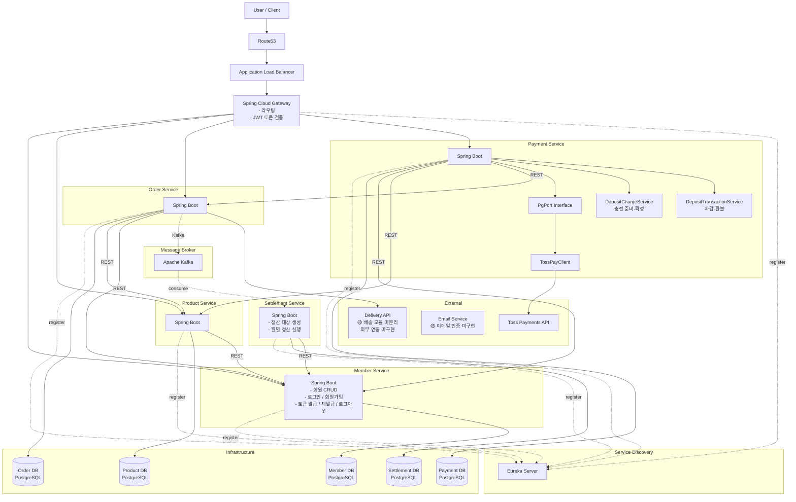

## 서비스 아키텍처 다이어그램

> MSA (Microservices Architecture) + 헥사고날 아키텍처 기반
> 도메인 5개 서비스 (Member / Product / Order / Payment / Settlement) + Gateway + Eureka
> 동기 통신은 REST API, 비동기 통신은 Kafka (구매확정→정산) + Spring Event (도메인 내부)
> 서비스 디스커버리: Eureka Server / API 라우팅 및 토큰 검증: Spring Cloud Gateway

---

### 전체 시스템 구성



---

### 인프라 구성 요소

| 구성 요소 | 기술 | 역할 |
|----------|------|------|
| API Gateway | Spring Cloud Gateway | 요청 라우팅, JWT 토큰 검증 (서명 확인 + 만료 확인 + 블랙리스트 조회) |
| Service Discovery | Eureka Server | 서비스 등록/탐색, 동적 라우팅 지원 |
| Message Broker | Apache Kafka | 서비스 간 비동기 이벤트 통신 |

### Gateway 역할 (토큰 검증만 수행)

Gateway는 토큰 **발급은 하지 않으며**, 발급된 토큰의 **검증만** 수행합니다.

| 단계 | Gateway에서 수행 | 설명 |
|------|:---:|------|
| JWT 서명 검증 | O | Secret Key로 토큰 위변조 확인 |
| 토큰 만료 확인 | O | `exp` 클레임 검증 |
| 블랙리스트 조회 | O | `jti`로 TOKEN_BLACKLIST 확인 |
| 공개 API 판별 | O | 인증 불필요 경로 바이패스 |
| role/email_verified 인가 | X | 각 서비스 내부에서 처리 |
| 비즈니스 로직 | X | 각 서비스 내부에서 처리 |

> 토큰 발급(로그인, 회원가입, 토큰 재발급)은 **Member Service**가 전담합니다.

---

### 서비스 간 통신 방식

| 구분 | 방식 | 사용 구간 | 설명 |
|------|------|----------|------|
| 동기 | REST API | 서비스 → 서비스 | 즉시 응답이 필요한 조회/검증 호출 (Eureka 기반 서비스 디스커버리) |
| 비동기 - Kafka | Kafka Event | 서비스 간 비동기 | 구매확정→정산 |
| 비동기 - Spring Event | ApplicationEventPublisher | 서비스 내부 | 도메인 내부 이벤트 처리 (각 서비스 내부에서만 사용) |

**동기 통신 (REST API)**

| 호출 방향 | 목적 |
|----------|------|
| Order → Product | 재고 및 가격 검증 |
| Order → Member | 배송지 조회, 회원 상태 확인, 예치금 차감/환급 (주문 취소 시) |
| Payment → Product | 재고 차감 (REST 동기 호출) |
| Payment → Order | 주문 조회, 주문 상태 변경 (PENDING → PAID) |
| Payment → Member | 회원 활성 확인, 예치금 잔액 조회/차감/충전 |
| Settlement → Member | 판매자 계좌 정보 조회 (정산 시) |
| Product → Member | 판매자 권한 및 상태 확인 |

**비동기 통신 (Kafka Event / Spring Event)**

> Kafka 이벤트 목록, Spring Event 목록, 삭제된 이벤트 이력은 [EventDesign.md](EventDesign.md) 참조

---

### 헥사고날 아키텍처 (서비스별 내부 구조)

```
service-name/
├── adapter/
│   ├── in/
│   │   ├── web/           ← Controller (REST API 수신)
│   │   └── kafka/         ← Kafka Consumer (이벤트 수신)
│   └── out/
│       ├── persistence/   ← JPA Repository, Entity
│       ├── kafka/         ← Kafka Producer (이벤트 발행)
│       ├── event/         ← Spring Event Publisher (도메인 이벤트 발행)
│       └── rest/          ← 다른 서비스 REST 호출 (FeignClient 등)
├── application/
│   ├── port/
│   │   ├── in/            ← UseCase 인터페이스
│   │   └── out/           ← Port 인터페이스 (DB, 외부 서비스)
│   └── service/           ← UseCase 구현체
└── domain/
    └── model/             ← 도메인 엔티티, VO, Enum
```

각 서비스는 동일한 헥사고날 구조를 따르며, Port/Adapter 패턴을 통해 비즈니스 로직과 인프라를 분리합니다. 서비스 간 호출 시 out adapter의 rest 또는 kafka adapter를 사용합니다.

---

### DB 분리 전략

각 서비스는 독립된 PostgreSQL 데이터베이스를 사용합니다 (Database per Service 패턴).

| 서비스 | DB | 주요 테이블 |
|--------|-----|------------|
| Member | member_db | MEMBER, ADDRESS, SELLER, REFRESH_TOKEN, TOKEN_BLACKLIST, PROCESSED_DEPOSIT_TRANSACTION |
| Product | product_db | PRODUCT, CATEGORY |
| Order | order_db | ORDER, ORDER_ITEM, CART, CART_ITEM, SHIPMENT |
| Payment | payment_db | PAYMENT, DEPOSIT |
| Settlement | settlement_db | SETTLEMENT_TARGET, SETTLEMENT, PROCESSED_EVENTS, SHEDLOCK |
