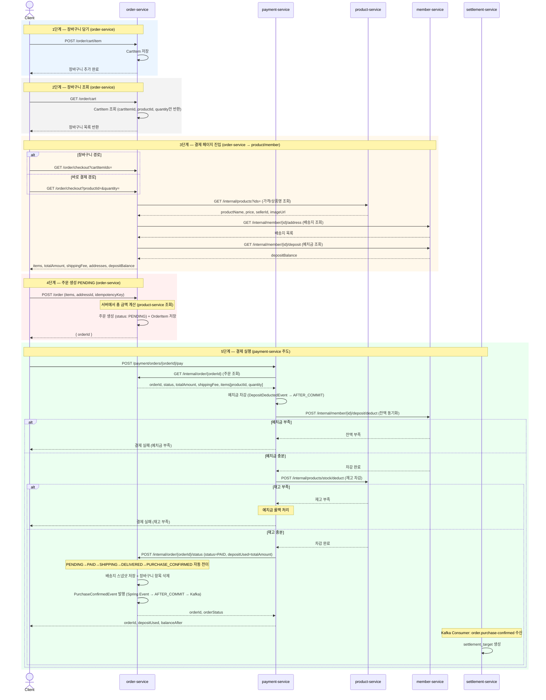
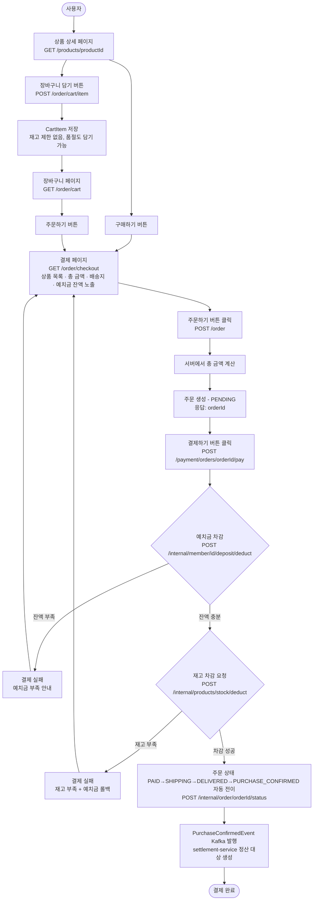
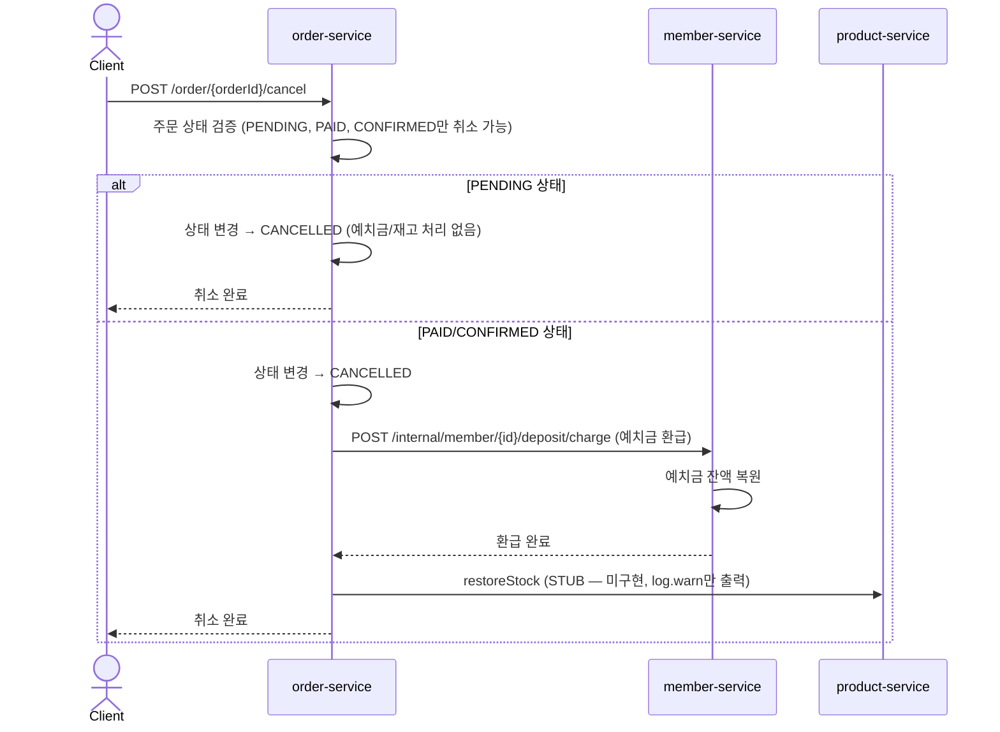

# 주문→결제 플로우 설계서

> 예치금 기반 결제 · 주문 생성과 결제 실행 분리 · 재고 차감은 REST 동기 호출 사용
> 5개 서비스: member-service / product-service / order-service / payment-service / settlement-service

---

## 핵심 원칙

- PG는 예치금 충전에만 사용한다 (Toss)
- 상품 결제는 무조건 예치금으로만 가능하다 (예치금 부족 시 결제 불가)
- 주문 생성(`POST /order`)과 결제 실행(`POST /payment/orders/{orderId}/pay`)은 분리된다
- 결제 실행 시 예치금 차감 → 재고 차감 순서로 처리한다 (payment-service 주도)
- 예치금 차감 실패 시 즉시 예외 반환 (재고 차감 전이므로 롤백 불필요)
- 재고 차감 실패 시 예치금 롤백 필요 (payment-service에서 보상 처리)
- 장바구니는 order-service 소속, 재고 제한 없이 담기 가능
- 총 금액은 서버에서 계산한다 (클라이언트 금액 신뢰하지 않음)
- PENDING 주문은 30분 경과 시 자동 취소 (PendingOrderCleanupScheduler)

---

## 진입 경로 2가지

| 경로 | 흐름 |
|------|------|
| A. 장바구니 경유 | 장바구니 담기 → 장바구니 조회 → 주문하기 버튼 → 결제 페이지 → 결제하기 |
| B. 바로 구매 | 상품 상세에서 구매하기 버튼 → 결제 페이지 → 결제하기 |

---

## 시퀀스 다이어그램



---

## 플로우차트



---

## 단계별 상세

### 1단계 — 장바구니 담기 (order-service)

- API: `POST /order/cart/item`
- 사용자가 상품을 장바구니에 담는다
- CartItem 저장 (productId, quantity)
- 재고 확인 안 함, 품절이어도 담기 가능

### 2단계 — 장바구니 조회 (order-service)

- API: `GET /order/cart`
- CartItem 목록 반환 (cartItemId, productId, quantity만 포함)
- product-service 호출 없음 — 상품 상세 정보(가격/재고/품절)는 미포함

### 3단계 — 결제 페이지 진입 (order-service → product/member)

- API: `GET /order/checkout?cartItemIds=` 또는 `GET /order/checkout?productId=&quantity=`
- 내부 호출: `GET /internal/products?ids=` (상품 가격/이름 조회 — product-service)
- 내부 호출: `GET /internal/member/{id}/address` (배송지 조회 — member-service)
- 내부 호출: `GET /internal/member/{id}/deposit` (예치금 잔액 조회 — member-service)
- 응답: items(productName, price, quantity, subtotal, imageUrl), totalAmount, shippingFee, addresses, depositBalance
- 이 시점에서는 아무것도 잠기지 않는다 (재고 차감 없음, 예치금 차감 없음)

### 4단계 — 주문 생성 PENDING (order-service)

- API: `POST /order`
1. **서버에서 총 금액 계산** (product-service 조회, 클라이언트 금액 신뢰하지 않음)
2. **주문 생성** (상태: PENDING, depositUsed=0, shippingSnapshot=null) + **OrderItem 저장**
3. **응답**: `{ orderId }`
   - 배송지 스냅샷은 이 시점에서 저장하지 않음 → 5단계 `updateStatus`(PAID) 시점에 저장

> 이 시점에서는 예치금 차감·재고 차감을 하지 않는다. PENDING 상태 30분 경과 시 자동 취소.

### 5단계 — 결제 실행 (payment-service 주도)

- API: `POST /payment/orders/{orderId}/pay`

아래 순서로 처리한다:

1. **주문 조회** → `GET /internal/order/{orderId}` (order-service)
   - 응답: orderId, status, totalAmount, shippingFee, items[productId, quantity]
2. **예치금 차감** → payment-service 내부 처리 + `DepositDeductedEvent`(AFTER_COMMIT) → `POST /internal/member/{id}/deposit/deduct` (member-service 잔액 동기화)
   - 실패 시 즉시 예외 반환 (재고 차감 전이므로 보상 불필요)
3. **재고 차감** → `POST /internal/products/stock/deduct` (product-service)
   - 실패 시 `refundDepositUseCase.refund()`로 예치금 롤백 후 예외 반환
4. **주문 상태 PAID 변경** → `POST /internal/order/{orderId}/status` (order-service)
   - 요청: `{ status: "PAID", depositUsed: totalAmount }`
   - order-service 내부에서 배송지 스냅샷 저장 + 장바구니 항목 삭제
   - PAID→SHIPPING→DELIVERED→PURCHASE_CONFIRMED 자동 전이
   - PURCHASE_CONFIRMED 전환 시 `PurchaseConfirmedEvent` Kafka 발행 (AFTER_COMMIT)
5. **settlement-service**: Kafka Consumer가 `order.purchase-confirmed` 토픽 수신 → `settlement_target` 생성

---

## 실패 케이스

| 시점 | 실패 사유 | 처리 |
|------|-----------|------|
| 결제하기 버튼 | 예치금 부족 | 잔액/부족 금액 안내, 결제 실패 (재고 차감 전이므로 재고 롤백 불필요) |
| 결제하기 버튼 | 재고 부족 | 품절 상품 안내, 결제 실패 (예치금 차감 후이므로 예치금 롤백 필요) |

예치금 차감 → 재고 차감 순서로 처리하므로, 재고 부족 시 payment-service가 예치금 롤백을 수행한다.

---

## 환불(취소) 플로우 (🔴 미구현)

> 🔴 **미구현** — 현재 결제 완료 시 PAID→SHIPPING→DELIVERED→PURCHASE_CONFIRMED 자동 전이로 운영 중이므로, PAID/CONFIRMED 상태에서의 취소·환불 플로우는 실질적으로 동작하지 않음. PENDING 취소(단순 상태 변경)만 유효.



> 🔴 **주의**: 재고 복원(`POST /internal/products/stock/restore`)은 product-service에 엔드포인트 미노출 상태. order-service `ProductServiceClient.restoreStock()`은 STUB으로 log.warn만 출력. PAID/CONFIRMED 취소 시 재고 복원 불가.
> 
> **참고**: 환불 시 payment-service의 `/internal/deposit/refund`를 사용하지 않고, order-service가 member-service의 `/internal/member/{id}/deposit/charge`를 직접 호출하여 예치금을 복원합니다.

---

## 주문 상태

| 상태 | 설명 |
|------|------|
| `PENDING` | 결제 대기 (주문 생성 직후, 30분 경과 시 자동 취소) |
| `PAID` | 결제 완료 (payment-service → order-service 상태 변경). 🟡 현재 PAID→SHIPPING→DELIVERED→PURCHASE_CONFIRMED 자동 전이 운영 중 (배송 모듈 미분리) |
| `CONFIRMED` | 주문 확정 (🟡 미사용 — 판매자 주문 승인 플로우 미구현) |
| `SHIPPING` | 배송 중 |
| `DELIVERED` | 배송 완료 |
| `PURCHASE_CONFIRMED` | 구매확정 → confirmed_at 기록, PurchaseConfirmedEvent Kafka 발행 → settlement-service 정산 대상 생성 |
| `CANCELLED` | 취소/환불 완료 |

---

## 이벤트 구분

| 구분 | 이벤트명 | 방식 | 발행 서비스 | 수신 서비스 | API/경로 |
|------|---------|------|-----------|-----------|---------|
| 구매확정 | PurchaseConfirmedEvent | Spring Event → Kafka | order-service | settlement-service | 토픽: `order.purchase-confirmed` |
| 예치금 충전 | DepositChargedEvent | Spring Event (AFTER_COMMIT) | payment-service | → member-service REST | `POST /internal/member/{id}/deposit/charge` |
| 예치금 차감 | DepositDeductedEvent | Spring Event (AFTER_COMMIT) | payment-service | → member-service REST | `POST /internal/member/{id}/deposit/deduct` |
| 예치금 환급 | DepositRefundedEvent | Spring Event (AFTER_COMMIT) | payment-service | → member-service REST | `POST /internal/member/{id}/deposit/charge` |

> 재고 차감/복원은 이벤트 없이 REST 동기 호출로 처리.

---

## API 엔드포인트 (모듈별)

### order-service
```
POST   /order/cart/item                    장바구니 상품 추가
GET    /order/cart                          장바구니 조회 (cartItemId, productId, quantity만 반환)
PATCH  /order/cart/item/{id}               장바구니 수량 수정
DELETE /order/cart/item/{id}               장바구니 상품 삭제
DELETE /order/cart                          장바구니 비우기
GET    /order/checkout                     결제 페이지 정보 조회 (상품, 배송지, 잔액)
POST   /order                              주문 생성 (PENDING)
GET    /order                              주문 목록 조회
GET    /order/{orderId}                    주문 상세 조회
POST   /order/{orderId}/cancel             주문 취소
POST   /order/{orderId}/confirm            구매확정
POST   /order/{orderId}/return             반품 신청
PATCH  /order/{orderId}/shipment           송장 등록 / 배송 상태 수정
```

### payment-service
```
POST   /payment/orders/{orderId}/pay       결제 실행 (예치금 차감 → 재고 차감 → 주문 PAID)
POST   /payment/deposit/charge/ready       예치금 충전 준비 (Toss PG)
POST   /payment/deposit/charge/confirm     예치금 충전 확정
GET    /payment/deposit/history            예치금 거래 내역 조회
```

### Internal API
```
GET    /internal/order/{orderId}           [order] 주문 조회 → payment
POST   /internal/order/{orderId}/status    [order] 주문 상태 변경 → payment
POST   /internal/order/cleanup             [order] 만료 PENDING 주문 수동 정리
DELETE /internal/order/cart/{memberId}     [order] 장바구니 삭제 → payment
GET    /internal/products?ids=             [product] 상품 가격/이름 조회 → order (checkout, 주문 생성)
POST   /internal/products/stock/deduct     [product] 재고 차감 → payment
POST   /internal/products/stock/restore    [product] 재고 복원 → order (🔴 STUB 미구현)
POST   /internal/deposit/deduct            [payment] 예치금 차감 (현재 미사용 — order가 member 직접 호출)
POST   /internal/deposit/refund            [payment] 예치금 환급 (현재 미사용 — order가 member 직접 호출)
POST   /internal/member/{id}/deposit/deduct  [member] 예치금 차감 → payment
POST   /internal/member/{id}/deposit/charge  [member] 예치금 충전/환급 → payment, order
GET    /internal/member/{id}/address       [member] 배송지 조회 → order
GET    /internal/member/{id}/deposit       [member] 예치금 조회 → order, payment
GET    /internal/member/{id}/active        [member] 회원 활성 확인 → order, payment
```
