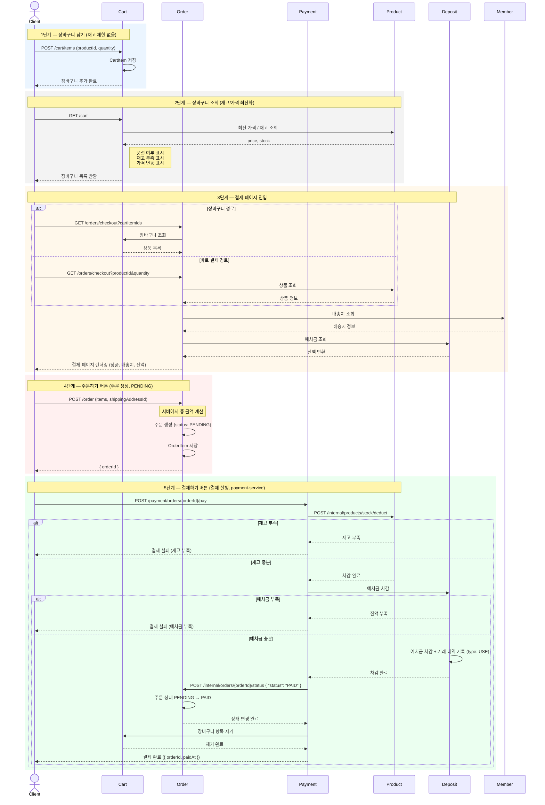
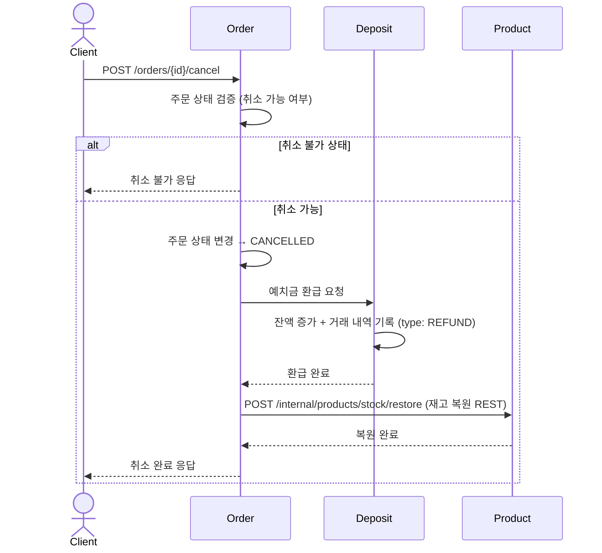

# 주문→결제 플로우 설계서

> 예치금 기반 결제 · 주문 생성과 결제 실행 분리 · 재고 차감은 REST 동기 호출 사용

---

## 핵심 원칙

- PG는 예치금 충전에만 사용한다
- 상품 결제는 무조건 예치금으로만 가능하다 (예치금 부족 시 결제 불가)
- 주문 생성(`POST /order`)과 결제 실행(`POST /payment/orders/{orderId}/pay`)은 분리된다
- 재고 검증/차감은 결제하기 버튼 클릭 시점에 payment-service가 REST로 직접 처리한다
- 재고 차감 실패 시 예치금 차감 없이 즉시 예외 반환 (롤백 불필요)
- 장바구니는 재고 제한 없이 담기 가능, 조회 시 품절/가격변동 표시
- 총 금액은 서버에서 계산한다 (클라이언트 금액 신뢰하지 않음)

---

## 진입 경로 2가지

| 경로 | 흐름 |
|------|------|
| A. 장바구니 경유 | 장바구니 담기 → 장바구니 조회 → 주문하기 버튼 → 결제 페이지 → 결제하기 |
| B. 바로 구매 | 상품 상세에서 구매하기 버튼 → 결제 페이지 → 결제하기 |

---

## 시퀀스 다이어그램

> 노션: `/code` 블록 → 언어 `Mermaid` 선택 → 아래 코드 붙여넣기 → "미리보기" 클릭



---

## 플로우차트

```mermaid
flowchart TD
    Start([사용자]) --> ProductPage[상품 상세 페이지]

    ProductPage --> BuyNow[구매하기 버튼]
    ProductPage --> AddCart[장바구니 담기 버튼]

    AddCart --> SaveCart[CartItem 저장<br/>재고 제한 없음, 품절도 담기 가능]
    SaveCart --> CartPage[장바구니 페이지]
    CartPage --> CartQuery[최신 가격/재고 조회<br/>품절·재고부족·가격변동 표시]
    CartQuery --> OrderBtn[주문하기 버튼]

    BuyNow --> CheckoutPage
    OrderBtn --> CheckoutPage

    CheckoutPage[결제 페이지<br/>상품 목록 · 총 금액 · 배송지 · 예치금 잔액 노출<br/>아무것도 잠기지 않음]

    CheckoutPage --> CreateOrderBtn[주문하기 버튼 클릭<br/>POST /order]

    CreateOrderBtn --> CalcTotal[서버에서 총 금액 계산]
    CalcTotal --> CreateOrder[주문 생성 - PENDING<br/>응답: orderId]
    CreateOrder --> PayBtn[결제하기 버튼 클릭<br/>POST /payment/orders/{orderId}/pay]

    PayBtn --> StockCheck{재고 차감 요청<br/>product-service REST}

    StockCheck -->|재고 부족| StockFail[결제 실패<br/>재고 부족 안내]
    StockFail --> CheckoutPage

    StockCheck -->|차감 성공| DepositCheck{예치금 확인}

    DepositCheck -->|잔액 부족| DepositFail[결제 실패<br/>예치금 부족 안내]
    DepositFail --> CheckoutPage

    DepositCheck -->|잔액 충분| DepositDeduct[예치금 차감]

    DepositDeduct --> UpdateOrderStatus[주문 상태 PENDING → PAID<br/>order-service REST]
    UpdateOrderStatus --> RemoveCart[장바구니 항목 제거]
    RemoveCart --> Complete([결제 완료])
```

---

## 단계별 상세

### 1단계 — 장바구니 담기 (재고 제한 없음)

- 사용자가 상품을 장바구니에 담는다
- CartItem 저장 (productId, quantity)
- 재고 확인 안 함, 품절이어도 담기 가능

### 2단계 — 장바구니 조회 (재고/가격 최신화)

- 장바구니 목록을 조회한다
- 각 상품의 최신 가격/재고를 조회한다
- 품절 여부, 재고 부족, 가격 변동을 표시한다
- 표시만 할 뿐 담기/제거를 강제하지 않는다

### 3단계 — 결제 페이지 진입

- 장바구니 경로: 장바구니에서 상품 목록 조회
- 바로 결제 경로: 상품 정보 직접 조회
- 회원의 배송지 정보를 조회하여 노출한다
- 예치금 잔액을 조회하여 화면에 노출한다
- 이 시점에서는 아무것도 잠기지 않는다 (재고 차감 없음, 예치금 차감 없음)

### 4단계 — 주문하기 버튼 클릭 (주문 생성, PENDING)

1. **서버에서 총 금액 계산** (클라이언트 금액 신뢰하지 않음)
2. **주문 생성** (상태: PENDING)
3. **OrderItem 저장**
4. **응답**: `{ orderId }`

> 이 시점에서는 예치금 차감·재고 차감을 하지 않는다. 결제 버튼을 눌러야 결제가 진행된다.

### 5단계 — 결제하기 버튼 클릭 (결제 실행, payment-service)

아래 순서로 처리한다:

1. **재고 차감** → `POST /internal/products/stock/deduct` (product-service REST)
   - 실패 시 즉시 예외 반환 (예치금 차감 이전이므로 롤백 불필요)
2. **예치금 차감** → 부족 시 결제 실패 반환
3. **주문 상태 PAID로 변경** → `POST /internal/orders/{orderId}/status` (order-service REST)
4. **장바구니 항목 제거** (장바구니 경유 시)

---

## 실패 케이스

| 시점 | 실패 사유 | 처리 |
|------|-----------|------|
| 결제하기 버튼 | 재고 부족 | 품절 상품 안내, 결제 실패 (예치금 차감 없음) |
| 결제하기 버튼 | 예치금 부족 | 잔액/부족 금액 안내, 결제 실패 |

재고 차감 → 예치금 차감 순서로 처리하므로, 재고 부족 시 예치금 롤백이 불필요하다.

---

## 환불(취소) 플로우



---

## 주문 상태

| 상태 | 설명 |
|------|------|
| `PENDING` | 결제 대기 (주문 생성 직후, 결제 실행 전) |
| `PAID` | 결제 완료 (payment-service 결제 완료 후) |
| `CONFIRMED` | 주문 확정 (판매자 확인) |
| `SHIPPING` | 배송 중 |
| `DELIVERED` | 배송 완료 |
| `PURCHASE_CONFIRMED` | 구매확정 → PurchaseConfirmedEvent 발행 (Kafka → Payment, 정산 대상 생성) |
| `CANCELLED` | 취소/환불 완료 |

---

## 이벤트 구분

| 구분 | 이벤트명 | 방식 | 목적 |
|------|---------|------|------|
| 구매 확정 | PurchaseConfirmedEvent | **Kafka** | Order → Payment, 정산 대상 생성 |
| 주문 취소 | OrderCancelledEvent | Spring Event | 취소 후처리 |

> 재고 차감/복원은 Kafka 이벤트가 아닌 REST 동기 호출로 처리합니다.
> - 차감: `POST /internal/products/stock/deduct` (payment-service → product-service)
> - 복원: `POST /internal/products/stock/restore` (order-service → product-service)

---

## API 엔드포인트

```
POST   /order/cart/item                          장바구니 상품 추가
GET    /order/cart                                장바구니 조회 (품절/가격변동 표시)
PATCH  /order/cart/item/{id}                     장바구니 수량 수정
DELETE /order/cart/item/{id}                     장바구니 상품 삭제
DELETE /order/cart                                장바구니 비우기

GET    /order/checkout                           결제 페이지 정보 조회 (상품, 배송지, 잔액)
POST   /order                                    주문 생성 (서버 금액 계산 → 주문 PENDING 상태 저장)
POST   /payment/orders/{orderId}/pay             결제 실행 (재고 차감 REST → 예치금 차감 → 주문 PAID)
POST   /order/{orderId}/cancel                   주문 취소 (예치금 환급 + 재고 복원 REST)
GET    /order                                    주문 목록 조회
GET    /order/{orderId}                          주문 상세 조회

POST   /internal/orders/{orderId}/status         [Internal] 주문 상태 변경 (payment-service 전용)
POST   /internal/products/stock/deduct           [Internal] 재고 차감 (payment-service → product-service)
POST   /internal/products/stock/restore          [Internal] 재고 복원 (order-service → product-service)
```
