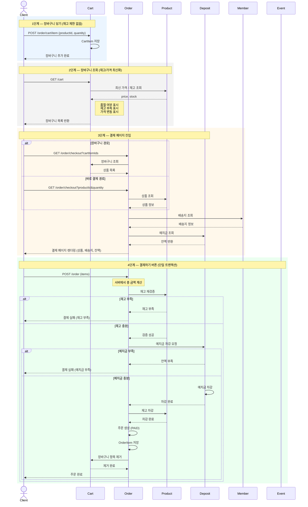
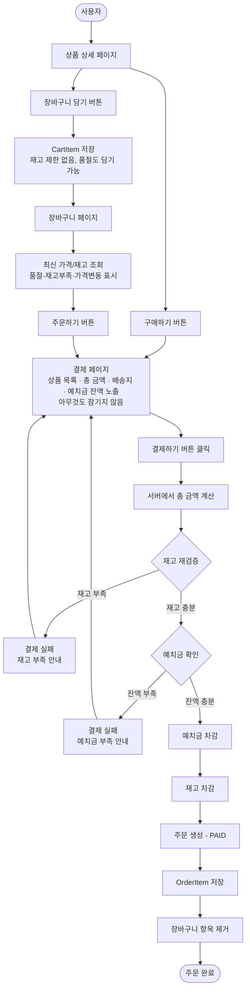
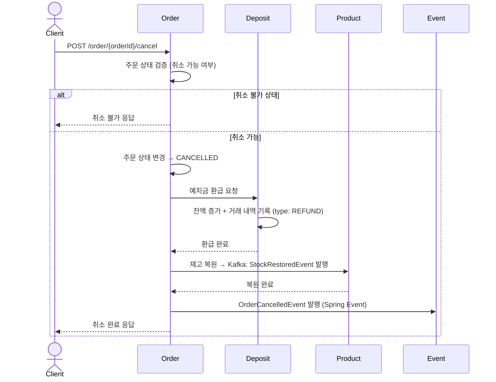

# 주문→결제 플로우 설계서

> 예치금 기반 결제 · 재고 검증은 결제 시점 · 서버 금액 계산 · 카프카는 재고 차감/복구에만 사용

---

## 핵심 원칙

- PG는 예치금 충전에만 사용한다
- 상품 결제는 무조건 예치금으로만 가능하다 (예치금 부족 시 결제 불가)
- 재고 검증/차감은 결제하기 버튼 클릭 시점에만 수행한다
- 장바구니는 재고 제한 없이 담기 가능, 조회 시 품절/가격변동 표시
- 총 금액은 서버에서 계산한다 (클라이언트 금액 신뢰하지 않음)
- 재고 차감/복구 이벤트만 Kafka, 나머지는 Spring Event

---

## 진입 경로 2가지

| 경로 | 흐름 |
|------|------|
| A. 장바구니 경유 | 장바구니 담기 → 장바구니 조회 → 주문하기 버튼 → 결제 페이지 → 결제하기 |
| B. 바로 구매 | 상품 상세에서 구매하기 버튼 → 결제 페이지 → 결제하기 |

---

## 시퀀스 다이어그램

> 노션: `/code` 블록 → 언어 `Mermaid` 선택 → 아래 코드 붙여넣기 → "미리보기" 클릭



---

## 플로우차트



---

## 단계별 상세

### 1단계 — 장바구니 담기 (재고 제한 없음)

- 사용자가 상품을 장바구니에 담는다
- CartItem 저장 (productId, quantity)
- 재고 확인 안 함, 품절이어도 담기 가능

### 2단계 — 장바구니 조회 (재고/가격 최신화)

- 장바구니 목록을 조회한다
- 각 상품의 최신 가격/재고를 조회한다
- 품절 여부, 재고 부족, 가격 변동을 표시한다
- 표시만 할 뿐 담기/제거를 강제하지 않는다

### 3단계 — 결제 페이지 진입

- 장바구니 경로: 장바구니에서 상품 목록 조회
- 바로 결제 경로: 상품 정보 직접 조회
- 회원의 배송지 정보를 조회하여 노출한다
- 예치금 잔액을 조회하여 화면에 노출한다
- 이 시점에서는 아무것도 잠기지 않는다 (재고 차감 없음, 예치금 차감 없음)

### 4단계 — 결제하기 버튼 클릭 (단일 트랜잭션)

아래 순서로 한 트랜잭션 내에서 처리한다:

1. **서버에서 총 금액 계산**
2. **재고 재검증** → 부족 시 결제 실패 (재고 부족)
3. **예치금 차감** → 부족 시 결제 실패 (예치금 부족)
4. **재고 차감** (stock -= quantity) → Kafka: StockDeductedEvent 발행
5. **주문 생성** (상태: PAID)
6. **OrderItem 저장**
7. **장바구니 항목 제거** (장바구니 경유 시)

---

## 실패 케이스

| 시점 | 실패 사유 | 처리 |
|------|-----------|------|
| 결제하기 버튼 | 재고 부족 | 품절 상품 안내, 결제 실패 |
| 결제하기 버튼 | 예치금 부족 | 잔액/부족 금액 안내, 결제 실패 |

재고를 예치금 차감 이후에 차감하기 때문에, 예치금 부족 시 재고 롤백이 필요 없다.

---

## 환불(취소) 플로우



---

## 주문 상태

| 상태 | 설명 |
|------|------|
| `PAID` | 결제 완료 (주문 생성 즉시) |
| `CONFIRMED` | 주문 확정 (판매자 확인) |
| `SHIPPING` | 배송 중 |
| `DELIVERED` | 배송 완료 |
| `PURCHASE_CONFIRMED` | 구매확정 → PurchaseConfirmedEvent 발행 (Kafka → Payment, 정산 대상 생성) |
| `CANCELLED` | 취소/환불 완료 |

> PENDING_PAYMENT 상태 불필요. 예치금 결제는 즉시 처리되므로 생성 즉시 PAID가 된다.

---

## 이벤트 구분

| 구분 | 이벤트명 | 방식 | 목적 |
|------|---------|------|------|
| 재고 차감 | StockDeductedEvent | **Kafka** | Order → Product, 재고 차감 반영 |
| 재고 복원 | StockRestoredEvent | **Kafka** | Order → Product, 재고 복원 반영 |
| 구매 확정 | PurchaseConfirmedEvent | **Kafka** | Order → Payment, 정산 대상 생성 |
| 주문 취소 | OrderCancelledEvent | Spring Event | 취소 후처리 |

---

## API 엔드포인트

```
POST   /order/cart/item              장바구니 상품 추가
GET    /order/cart                    장바구니 조회 (품절/가격변동 표시)
PATCH  /order/cart/item/{id}         장바구니 수량 수정
DELETE /order/cart/item/{id}         장바구니 상품 삭제
DELETE /order/cart                    장바구니 비우기

GET    /order/checkout               결제 페이지 정보 조회 (상품, 배송지, 잔액)
POST   /order                        결제하기 (서버 금액 계산 → 재고 검증 → 예치금 차감 → 재고 차감 → 주문 생성)
POST   /order/{orderId}/cancel       주문 취소 (예치금 환급 + 재고 복원)
GET    /order                        주문 목록 조회
GET    /order/{orderId}              주문 상세 조회
```
